## Observations and Insights 

The present document shows the undesirable effect of the drug Capomulin as a treatment for squamous cell carcinoma (SCC) concerning other therapies. For this, a study was carried out with 249 laboratory mice identified with this SCC tumor’s growth.

In 45 days, the tumor growth was performed and measured in these mice. Analysis groups were conducted to compare Capomuliin with other treatments. There is also a control group (Placebo) to identify Capmulin and the different treatments’ performance.

The performance of this drug was scored based on survival and tumor shrinkage. As shown in the figure “Summary: Number of mice per drug regimen over time,” the Capomulon and Racomilin treatments are the only treatments where the number of mice throughout the analysis period is greater than the control group. In the Capomulin group, 84% of mice survived (Ramicase 80% survived).
Likewise, concerning tumor reduction, better performance is observed in the Capomulin and Regimen treatments, as shown in the figure Summary: Average tumor volume per drug Acroos Timepoint Regimen, in relation to the control group. With the Caomulin treatment on average, the tumor volume was reduced by 19.47%; also, the Ramicane group treated with this drug showed a 22.32% reduction.

In general, in the group treated with Capomulin, a decrease in volume is observed; it also has a higher survival number. Considering these two factors, Capomulin is the best performing drug. The biggest competitor is Racimcane, with a behavior similar to Capomulin.


```python
# Dependencies and Setup
import matplotlib.pyplot as plt
import pandas as pd
import scipy.stats as st
import numpy as np

from scipy.stats import linregress


# Study data files
mouse_metadata_path = "Data/Mouse_metadata.csv"
study_results_path = "Data/Study_results.csv"

# Read the mouse data and the study results
mouse_metadata = pd.read_csv(mouse_metadata_path)
study_results = pd.read_csv(study_results_path)

# Combine the data into a single dataset
PharmaStudyData=pd.merge(mouse_metadata, study_results, how='outer', on='Mouse ID' )


#Set the Drug of Interest
DrugOfInterest='Capomulin'
GroupOfControl='Placebo'  #To help visualitation of data

#Dict for the boxplot
square = dict(markerfacecolor='black', marker='s')


#Set instructions for boxplot
InstrutionsSet=['Capomulin', 'Ramicane', 'Infubinol', 'Ceftamin']
```


```python
# Checking the number of mice in the DataFrame.
BeforeClean=pd.DataFrame(PharmaStudyData.groupby(['Timepoint'])['Mouse ID'].count())


```


```python
# Getting the duplicate mice by ID number that shows up for Mouse ID and Timepoint.
# Optional: Get all the data for the duplicate mouse ID.
DuplicateMice=PharmaStudyData.loc[PharmaStudyData[['Mouse ID','Timepoint','Drug Regimen']].duplicated(keep='first')]
DuplicateMice
```


<div>
<style scoped>
    .dataframe tbody tr th:only-of-type {
        vertical-align: middle;
    }

    .dataframe tbody tr th {
        vertical-align: top;
    }

    .dataframe thead th {
        text-align: right;
    }
</style>
<table border="1" class="dataframe">
  <thead>
    <tr style="text-align: right;">
      <th></th>
      <th>Mouse ID</th>
      <th>Drug Regimen</th>
      <th>Sex</th>
      <th>Age_months</th>
      <th>Weight (g)</th>
      <th>Timepoint</th>
      <th>Tumor Volume (mm3)</th>
      <th>Metastatic Sites</th>
    </tr>
  </thead>
  <tbody>
    <tr>
      <th>909</th>
      <td>g989</td>
      <td>Propriva</td>
      <td>Female</td>
      <td>21</td>
      <td>26</td>
      <td>0</td>
      <td>45.000000</td>
      <td>0</td>
    </tr>
    <tr>
      <th>911</th>
      <td>g989</td>
      <td>Propriva</td>
      <td>Female</td>
      <td>21</td>
      <td>26</td>
      <td>5</td>
      <td>47.570392</td>
      <td>0</td>
    </tr>
    <tr>
      <th>913</th>
      <td>g989</td>
      <td>Propriva</td>
      <td>Female</td>
      <td>21</td>
      <td>26</td>
      <td>10</td>
      <td>49.880528</td>
      <td>0</td>
    </tr>
    <tr>
      <th>915</th>
      <td>g989</td>
      <td>Propriva</td>
      <td>Female</td>
      <td>21</td>
      <td>26</td>
      <td>15</td>
      <td>53.442020</td>
      <td>0</td>
    </tr>
    <tr>
      <th>917</th>
      <td>g989</td>
      <td>Propriva</td>
      <td>Female</td>
      <td>21</td>
      <td>26</td>
      <td>20</td>
      <td>54.657650</td>
      <td>1</td>
    </tr>
  </tbody>
</table>
</div>


```python
 # Create a clean DataFrame by dropping the duplicate mouse by its ID.
PharmaStudyData=PharmaStudyData.drop_duplicates(subset=['Mouse ID','Timepoint'], keep='first', inplace=False)

```


```python
MiceInStudyData=PharmaStudyData.drop_duplicates(subset=['Mouse ID'], keep='last', inplace=False)
MiceInStudyData.head()
```


<div>
<style scoped>
    .dataframe tbody tr th:only-of-type {
        vertical-align: middle;
    }

    .dataframe tbody tr th {
        vertical-align: top;
    }

    .dataframe thead th {
        text-align: right;
    }
</style>
<table border="1" class="dataframe">
  <thead>
    <tr style="text-align: right;">
      <th></th>
      <th>Mouse ID</th>
      <th>Drug Regimen</th>
      <th>Sex</th>
      <th>Age_months</th>
      <th>Weight (g)</th>
      <th>Timepoint</th>
      <th>Tumor Volume (mm3)</th>
      <th>Metastatic Sites</th>
    </tr>
  </thead>
  <tbody>
    <tr>
      <th>9</th>
      <td>k403</td>
      <td>Ramicane</td>
      <td>Male</td>
      <td>21</td>
      <td>16</td>
      <td>45</td>
      <td>22.050126</td>
      <td>1</td>
    </tr>
    <tr>
      <th>19</th>
      <td>s185</td>
      <td>Capomulin</td>
      <td>Female</td>
      <td>3</td>
      <td>17</td>
      <td>45</td>
      <td>23.343598</td>
      <td>1</td>
    </tr>
    <tr>
      <th>29</th>
      <td>x401</td>
      <td>Capomulin</td>
      <td>Female</td>
      <td>16</td>
      <td>15</td>
      <td>45</td>
      <td>28.484033</td>
      <td>0</td>
    </tr>
    <tr>
      <th>39</th>
      <td>m601</td>
      <td>Capomulin</td>
      <td>Male</td>
      <td>22</td>
      <td>17</td>
      <td>45</td>
      <td>28.430964</td>
      <td>1</td>
    </tr>
    <tr>
      <th>49</th>
      <td>g791</td>
      <td>Ramicane</td>
      <td>Male</td>
      <td>11</td>
      <td>16</td>
      <td>45</td>
      <td>29.128472</td>
      <td>1</td>
    </tr>
  </tbody>
</table>
</div>


```python

#Set Frames to use for the analysis

#For Drug Regimen across Timepoint
DrugName=[name for name in PharmaStudyData['Drug Regimen'].unique()]

FramesByDrug=[]
for name in DrugName:
    FramesByDrug.append(PharmaStudyData.loc[lambda PharmaStudyData:PharmaStudyData['Drug Regimen']==name])

#For Timepoint across Drug Regimen
TimePoint=[time for time in PharmaStudyData['Timepoint'].unique()]

FramesByTime=[]
for time in TimePoint:
    FramesByTime.append(PharmaStudyData.loc[lambda PharmaStudyData:PharmaStudyData['Timepoint']==time])
    
```


```python
# Checking the number of mice in the clean DataFrame.
AfterClean=pd.DataFrame(PharmaStudyData.groupby(['Timepoint'])['Mouse ID'].count())
Compare=pd.merge(BeforeClean, AfterClean, how='outer', on='Timepoint', suffixes=("_Before","_After") )
Compare['Change']=Compare['Mouse ID_After']-Compare['Mouse ID_Before']
Compare
```


<div>
<style scoped>
    .dataframe tbody tr th:only-of-type {
        vertical-align: middle;
    }

    .dataframe tbody tr th {
        vertical-align: top;
    }

    .dataframe thead th {
        text-align: right;
    }
</style>
<table border="1" class="dataframe">
  <thead>
    <tr style="text-align: right;">
      <th></th>
      <th>Mouse ID_Before</th>
      <th>Mouse ID_After</th>
      <th>Change</th>
    </tr>
    <tr>
      <th>Timepoint</th>
      <th></th>
      <th></th>
      <th></th>
    </tr>
  </thead>
  <tbody>
    <tr>
      <th>0</th>
      <td>250</td>
      <td>249</td>
      <td>-1</td>
    </tr>
    <tr>
      <th>5</th>
      <td>238</td>
      <td>237</td>
      <td>-1</td>
    </tr>
    <tr>
      <th>10</th>
      <td>223</td>
      <td>222</td>
      <td>-1</td>
    </tr>
    <tr>
      <th>15</th>
      <td>207</td>
      <td>206</td>
      <td>-1</td>
    </tr>
    <tr>
      <th>20</th>
      <td>195</td>
      <td>194</td>
      <td>-1</td>
    </tr>
    <tr>
      <th>25</th>
      <td>183</td>
      <td>183</td>
      <td>0</td>
    </tr>
    <tr>
      <th>30</th>
      <td>171</td>
      <td>171</td>
      <td>0</td>
    </tr>
    <tr>
      <th>35</th>
      <td>154</td>
      <td>154</td>
      <td>0</td>
    </tr>
    <tr>
      <th>40</th>
      <td>142</td>
      <td>142</td>
      <td>0</td>
    </tr>
    <tr>
      <th>45</th>
      <td>130</td>
      <td>130</td>
      <td>0</td>
    </tr>
  </tbody>
</table>
</div>


```python
pd.DataFrame({'Total':PharmaStudyData['Mouse ID'].nunique()}, index=['Mice'])

```


<div>
<style scoped>
    .dataframe tbody tr th:only-of-type {
        vertical-align: middle;
    }

    .dataframe tbody tr th {
        vertical-align: top;
    }

    .dataframe thead th {
        text-align: right;
    }
</style>
<table border="1" class="dataframe">
  <thead>
    <tr style="text-align: right;">
      <th></th>
      <th>Total</th>
    </tr>
  </thead>
  <tbody>
    <tr>
      <th>Mice</th>
      <td>249</td>
    </tr>
  </tbody>
</table>
</div>


## Summary Statistics


```python

```


```python
# Generate a summary statistics table of mean, median, variance, standard deviation, and SEM of the tumor volume for each regimen

#Set Summary with the following code to have Drug Regimen and Timepoint using dict and DataFrame
SummaryDrugRegimen=[]
for drug in range(len(DrugName)):
    name=DrugName[drug]
    count=FramesByDrug[drug].groupby(['Timepoint'])['Tumor Volume (mm3)'].count()
    mean=FramesByDrug[drug].groupby(['Timepoint'])['Tumor Volume (mm3)'].mean()
    median=FramesByDrug[drug].groupby(['Timepoint'])['Tumor Volume (mm3)'].median()
    var=FramesByDrug[drug].groupby(['Timepoint'])['Tumor Volume (mm3)'].var()
    std=FramesByDrug[drug].groupby(['Timepoint'])['Tumor Volume (mm3)'].std()
    sem=FramesByDrug[drug].groupby(['Timepoint'])['Tumor Volume (mm3)'].sem()
    SummaryDrugRegimen.append(pd.DataFrame({
        'Drug Regimen':name,
        'Mice count':count,
        'Tumor volumen average':mean,
        'Tumor volumen median':median,
        'Tumor volumen var':var,
        'Tumor volumen std':std,
        'Tumor volumen sem':sem
        }))
    
SummaryDrugRegimen[1] #Show the result of the Drug of Interest using the first method code


```


<div>
<style scoped>
    .dataframe tbody tr th:only-of-type {
        vertical-align: middle;
    }

    .dataframe tbody tr th {
        vertical-align: top;
    }

    .dataframe thead th {
        text-align: right;
    }
</style>
<table border="1" class="dataframe">
  <thead>
    <tr style="text-align: right;">
      <th></th>
      <th>Drug Regimen</th>
      <th>Mice count</th>
      <th>Tumor volumen average</th>
      <th>Tumor volumen median</th>
      <th>Tumor volumen var</th>
      <th>Tumor volumen std</th>
      <th>Tumor volumen sem</th>
    </tr>
    <tr>
      <th>Timepoint</th>
      <th></th>
      <th></th>
      <th></th>
      <th></th>
      <th></th>
      <th></th>
      <th></th>
    </tr>
  </thead>
  <tbody>
    <tr>
      <th>0</th>
      <td>Capomulin</td>
      <td>25</td>
      <td>45.000000</td>
      <td>45.000000</td>
      <td>0.000000</td>
      <td>0.000000</td>
      <td>0.000000</td>
    </tr>
    <tr>
      <th>5</th>
      <td>Capomulin</td>
      <td>25</td>
      <td>44.266086</td>
      <td>45.597064</td>
      <td>5.030889</td>
      <td>2.242964</td>
      <td>0.448593</td>
    </tr>
    <tr>
      <th>10</th>
      <td>Capomulin</td>
      <td>25</td>
      <td>43.084291</td>
      <td>43.421014</td>
      <td>12.344133</td>
      <td>3.513422</td>
      <td>0.702684</td>
    </tr>
    <tr>
      <th>15</th>
      <td>Capomulin</td>
      <td>24</td>
      <td>42.064317</td>
      <td>42.798160</td>
      <td>16.878693</td>
      <td>4.108369</td>
      <td>0.838617</td>
    </tr>
    <tr>
      <th>20</th>
      <td>Capomulin</td>
      <td>23</td>
      <td>40.716325</td>
      <td>40.716428</td>
      <td>19.035028</td>
      <td>4.362915</td>
      <td>0.909731</td>
    </tr>
    <tr>
      <th>25</th>
      <td>Capomulin</td>
      <td>22</td>
      <td>39.939528</td>
      <td>40.224165</td>
      <td>17.100444</td>
      <td>4.135268</td>
      <td>0.881642</td>
    </tr>
    <tr>
      <th>30</th>
      <td>Capomulin</td>
      <td>22</td>
      <td>38.769339</td>
      <td>39.260371</td>
      <td>19.210721</td>
      <td>4.383004</td>
      <td>0.934460</td>
    </tr>
    <tr>
      <th>35</th>
      <td>Capomulin</td>
      <td>22</td>
      <td>37.816839</td>
      <td>38.360455</td>
      <td>24.358640</td>
      <td>4.935447</td>
      <td>1.052241</td>
    </tr>
    <tr>
      <th>40</th>
      <td>Capomulin</td>
      <td>21</td>
      <td>36.958001</td>
      <td>36.843898</td>
      <td>31.441568</td>
      <td>5.607278</td>
      <td>1.223608</td>
    </tr>
    <tr>
      <th>45</th>
      <td>Capomulin</td>
      <td>21</td>
      <td>36.236114</td>
      <td>37.311846</td>
      <td>31.460537</td>
      <td>5.608969</td>
      <td>1.223977</td>
    </tr>
  </tbody>
</table>
</div>


```python

```


```python
# This method is the most straighforward, creating multiple series and putting them all together at the end.

#Set Summary with the following code to have Drug Regimen and Timepoint using .agg() method
StatistcsDrugRegime=[]
for drug in range(len(DrugName)):
    Summary=FramesByDrug[drug].groupby(['Timepoint']).agg(['count','mean','median','var','std','sem'])["Tumor Volume (mm3)"]
    StatistcsDrugRegime.append(Summary)

StatistcsDrugRegime[1] #Show the result of the Drug of Interest using the scond method code

```


<div>
<style scoped>
    .dataframe tbody tr th:only-of-type {
        vertical-align: middle;
    }

    .dataframe tbody tr th {
        vertical-align: top;
    }

    .dataframe thead th {
        text-align: right;
    }
</style>
<table border="1" class="dataframe">
  <thead>
    <tr style="text-align: right;">
      <th></th>
      <th>count</th>
      <th>mean</th>
      <th>median</th>
      <th>var</th>
      <th>std</th>
      <th>sem</th>
    </tr>
    <tr>
      <th>Timepoint</th>
      <th></th>
      <th></th>
      <th></th>
      <th></th>
      <th></th>
      <th></th>
    </tr>
  </thead>
  <tbody>
    <tr>
      <th>0</th>
      <td>25</td>
      <td>45.000000</td>
      <td>45.000000</td>
      <td>0.000000</td>
      <td>0.000000</td>
      <td>0.000000</td>
    </tr>
    <tr>
      <th>5</th>
      <td>25</td>
      <td>44.266086</td>
      <td>45.597064</td>
      <td>5.030889</td>
      <td>2.242964</td>
      <td>0.448593</td>
    </tr>
    <tr>
      <th>10</th>
      <td>25</td>
      <td>43.084291</td>
      <td>43.421014</td>
      <td>12.344133</td>
      <td>3.513422</td>
      <td>0.702684</td>
    </tr>
    <tr>
      <th>15</th>
      <td>24</td>
      <td>42.064317</td>
      <td>42.798160</td>
      <td>16.878693</td>
      <td>4.108369</td>
      <td>0.838617</td>
    </tr>
    <tr>
      <th>20</th>
      <td>23</td>
      <td>40.716325</td>
      <td>40.716428</td>
      <td>19.035028</td>
      <td>4.362915</td>
      <td>0.909731</td>
    </tr>
    <tr>
      <th>25</th>
      <td>22</td>
      <td>39.939528</td>
      <td>40.224165</td>
      <td>17.100444</td>
      <td>4.135268</td>
      <td>0.881642</td>
    </tr>
    <tr>
      <th>30</th>
      <td>22</td>
      <td>38.769339</td>
      <td>39.260371</td>
      <td>19.210721</td>
      <td>4.383004</td>
      <td>0.934460</td>
    </tr>
    <tr>
      <th>35</th>
      <td>22</td>
      <td>37.816839</td>
      <td>38.360455</td>
      <td>24.358640</td>
      <td>4.935447</td>
      <td>1.052241</td>
    </tr>
    <tr>
      <th>40</th>
      <td>21</td>
      <td>36.958001</td>
      <td>36.843898</td>
      <td>31.441568</td>
      <td>5.607278</td>
      <td>1.223608</td>
    </tr>
    <tr>
      <th>45</th>
      <td>21</td>
      <td>36.236114</td>
      <td>37.311846</td>
      <td>31.460537</td>
      <td>5.608969</td>
      <td>1.223977</td>
    </tr>
  </tbody>
</table>
</div>


### Summary graphs of number of mice and tumor volume


```python
#To help the analysis is included the a Summary Plot. This plot shows the number of mice in each Drug Regimen

fig1=plt.figure(figsize=(15,8), tight_layout=True)

for n in range(len(DrugName)):
    if DrugName[n]==DrugOfInterest:
        plt.plot(TimePoint, SummaryDrugRegimen[n]['Mice count'], marker='o', color='darkblue', label=DrugName[n])
        
    
    elif DrugName[n]==GroupOfControl:
        plt.plot(TimePoint, SummaryDrugRegimen[n]['Mice count'], marker='s', color='black', label=f'{DrugName[n]} (Group of Control)')
            
    
    else:
        plt.plot(TimePoint, SummaryDrugRegimen[n]['Mice count'], label=DrugName[n])
                
plt.title('Summary: Number of Mice by Drug Regimen across Timepoint', fontsize='xx-large')
plt.legend(bbox_to_anchor=(1.05, 1), loc='best', borderaxespad=0., fontsize='large')
plt.grid(lw=0.2)
plt.xticks(TimePoint, rotation='vertical')
plt.ylabel('Number of mice', fontsize='large')
plt.xlabel('Timepoint', fontsize='large')
plt.show()


```


    
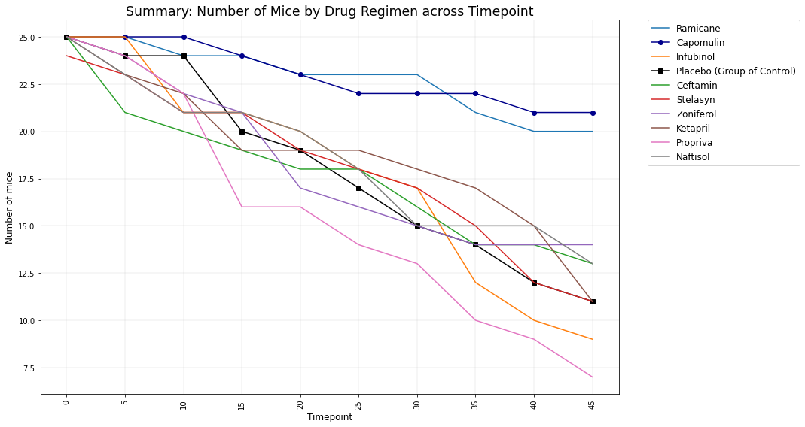
    


```python

```


```python
#To help the analysis is included the a Summary Plot. This plot shows the Average of Tumor Volume in each Drug Regimen

fig2=plt.figure(figsize=(15,8), tight_layout=True)

for n in range(len(DrugName)):
    if DrugName[n]==DrugOfInterest:
        plt.plot(TimePoint, SummaryDrugRegimen[n]['Tumor volumen average'], marker='o', color='darkblue', label=DrugName[n])
        
    
    elif DrugName[n]==GroupOfControl:
        plt.plot(TimePoint, SummaryDrugRegimen[n]['Tumor volumen average'], marker='s', color='black', label=f'{DrugName[n]} (Group of Control)')
            
    
    else:
        plt.plot(TimePoint, SummaryDrugRegimen[n]['Tumor volumen average'], label=DrugName[n])
                
plt.title('Summary: Tumor Volume Average by Drug Regimen across Timepoint', fontsize='xx-large')
plt.legend(bbox_to_anchor=(1.05, 1), loc='best', borderaxespad=0., fontsize='large')
plt.grid(lw=0.2)
plt.xticks(TimePoint, rotation='vertical')
plt.ylabel('Volumne (mm3)', fontsize='large')
plt.xlabel('Timepoint', fontsize='large')
plt.show()

```


    
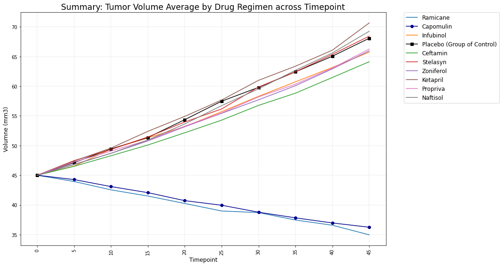
    


```python
# Generate a summary statistics table of mean, median, variance, standard deviation, and SEM of the tumor volume for each regimen

#Show the evolution of the Drug Regimen in each Timepoint 
for drug in range(len(DrugName)):
    columns=['Mice count','Tumor volumen average','Tumor volumen median','Tumor volumen var','Tumor volumen sem']
    if DrugName[drug]==DrugOfInterest:
        
        Output=f'''
--------------------------------- Statics for Drug of interest: {DrugName[drug]} ----------------------------------
    
         {SummaryDrugRegimen[drug].to_string(buf=None, index=True, header=True, justify='justify-all', columns=columns)}
        
        '''
    elif DrugName[drug]==GroupOfControl:
         
            Output=f'''
--------------------------------- Statics for Group of Control: {DrugName[drug]} ----------------------------------
    
         {SummaryDrugRegimen[drug].to_string(buf=None, index=True, header=True, justify='justify-all', columns=columns)}
        
        '''   
    
    else:
         Output=f'''
---------------------------------- Statics for Other treatment regimens: {DrugName[drug]} -------------------------
    
         {SummaryDrugRegimen[drug].to_string(buf=None, index=True, header=True, justify='justify-all',columns=columns)}
       
        '''       
    print(Output)
        
```

    
    ---------------------------------- Statics for Other treatment regimens: Ramicane -------------------------
        
                        Mice count  Tumor volumen average  Tumor volumen median  Tumor volumen var  Tumor volumen sem
    Timepoint                                                                                               
    0                  25              45.000000             45.000000           0.000000           0.000000
    5                  25              43.944859             45.521875           5.831150           0.482955
    10                 24              42.531957             42.832023          12.449365           0.720225
    15                 24              41.495061             41.262007          14.245578           0.770432
    20                 23              40.238325             40.772803          14.216521           0.786199
    25                 23              38.974300             38.097513          12.833914           0.746991
    30                 23              38.703137             38.242066          17.205421           0.864906
    35                 21              37.451996             37.624710          19.654473           0.967433
    40                 20              36.574081             35.668692          25.467778           1.128445
    45                 20              34.955595             34.848627          30.101010           1.226805
           
            
    
    --------------------------------- Statics for Drug of interest: Capomulin ----------------------------------
        
                        Mice count  Tumor volumen average  Tumor volumen median  Tumor volumen var  Tumor volumen sem
    Timepoint                                                                                               
    0                  25              45.000000             45.000000           0.000000           0.000000
    5                  25              44.266086             45.597064           5.030889           0.448593
    10                 25              43.084291             43.421014          12.344133           0.702684
    15                 24              42.064317             42.798160          16.878693           0.838617
    20                 23              40.716325             40.716428          19.035028           0.909731
    25                 22              39.939528             40.224165          17.100444           0.881642
    30                 22              38.769339             39.260371          19.210721           0.934460
    35                 22              37.816839             38.360455          24.358640           1.052241
    40                 21              36.958001             36.843898          31.441568           1.223608
    45                 21              36.236114             37.311846          31.460537           1.223977
            
            
    
    ---------------------------------- Statics for Other treatment regimens: Infubinol -------------------------
        
                        Mice count  Tumor volumen average  Tumor volumen median  Tumor volumen var  Tumor volumen sem
    Timepoint                                                                                               
    0                  25              45.000000             45.000000           0.000000           0.000000
    5                  25              46.541247             46.870483           5.689821           0.477067
    10                 21              49.403909             49.471244           1.674104           0.282346
    15                 21              51.296397             51.265440           2.687010           0.357705
    20                 20              53.197691             53.862724           4.535510           0.476210
    25                 18              55.715252             55.924633           5.451230           0.550315
    30                 17              58.299397             59.133640           6.770048           0.631061
    35                 12              60.742461             60.722723          11.622731           0.984155
    40                 10              63.162824             63.344283          11.134885           1.055220
    45                  9              65.755562             66.083066          11.787426           1.144427
           
            
    
    --------------------------------- Statics for Group of Control: Placebo ----------------------------------
        
                        Mice count  Tumor volumen average  Tumor volumen median  Tumor volumen var  Tumor volumen sem
    Timepoint                                                                                               
    0                  25              45.000000             45.000000           0.000000           0.000000
    5                  24              47.125589             46.989764           1.141526           0.218091
    10                 24              49.423329             49.109721           3.879727           0.402064
    15                 20              51.359742             51.271314           7.551257           0.614461
    20                 19              54.364417             53.006865          13.393928           0.839609
    25                 17              57.482574             57.106418          18.206321           1.034872
    30                 15              59.809063             59.916934          22.261308           1.218231
    35                 14              62.420615             62.970450          23.206488           1.287481
    40                 12              65.052675             66.287744          22.543652           1.370634
    45                 11              68.084082             69.042841          20.098783           1.351726
            
            
    
    ---------------------------------- Statics for Other treatment regimens: Ceftamin -------------------------
        
                        Mice count  Tumor volumen average  Tumor volumen median  Tumor volumen var  Tumor volumen sem
    Timepoint                                                                                               
    0                  25              45.000000             45.000000           0.000000           0.000000
    5                  21              46.503051             46.370798           0.568299           0.164505
    10                 20              48.285125             48.164520           1.115284           0.236144
    15                 19              50.094055             49.746427           2.094922           0.332053
    20                 18              52.157049             52.112973           2.326097           0.359482
    25                 18              54.287674             54.275954           3.474610           0.439356
    30                 16              56.769517             56.362744           3.851331           0.490620
    35                 14              58.827548             58.208362           6.708893           0.692248
    40                 14              61.467895             60.600972           7.027713           0.708505
    45                 13              64.132421             64.299830          10.585242           0.902358
           
            
    
    ---------------------------------- Statics for Other treatment regimens: Stelasyn -------------------------
        
                        Mice count  Tumor volumen average  Tumor volumen median  Tumor volumen var  Tumor volumen sem
    Timepoint                                                                                               
    0                  24              45.000000             45.000000           0.000000           0.000000
    5                  23              47.470830             47.054185           1.493585           0.254830
    10                 21              49.335368             48.925056           4.472114           0.461474
    15                 21              51.448025             51.166757           5.963724           0.532904
    20                 19              53.970080             53.983436           8.906693           0.684670
    25                 18              56.172821             56.522591          11.072836           0.784320
    30                 17              59.870528             60.605440          15.439026           0.952984
    35                 15              62.432021             63.756990          17.250985           1.072411
    40                 12              65.356386             67.396174          23.871927           1.410435
    45                 11              68.438310             69.299149          27.340818           1.576556
           
            
    
    ---------------------------------- Statics for Other treatment regimens: Zoniferol -------------------------
        
                        Mice count  Tumor volumen average  Tumor volumen median  Tumor volumen var  Tumor volumen sem
    Timepoint                                                                                               
    0                  25              45.000000             45.000000           0.000000           0.000000
    5                  24              46.851818             46.736212           0.856853           0.188950
    10                 22              48.689881             48.334346           1.532725           0.263949
    15                 21              50.779059             50.583557           2.883366           0.370544
    20                 17              53.170334             52.693423           4.832817           0.533182
    25                 16              55.432935             55.676604           5.808348           0.602513
    30                 15              57.713531             57.419744           9.601024           0.800043
    35                 14              60.089372             60.365832          10.876760           0.881426
    40                 14              62.916692             62.274543          13.958456           0.998515
    45                 14              65.960888             65.684689          14.100301           1.003576
           
            
    
    ---------------------------------- Statics for Other treatment regimens: Ketapril -------------------------
        
                        Mice count  Tumor volumen average  Tumor volumen median  Tumor volumen var  Tumor volumen sem
    Timepoint                                                                                               
    0                  25              45.000000             45.000000           0.000000           0.000000
    5                  23              47.389175             47.059664           1.612964           0.264819
    10                 22              49.582269             49.797416           2.810499           0.357421
    15                 19              52.399974             52.246310           6.397507           0.580268
    20                 19              54.920935             54.250054          10.027796           0.726484
    25                 19              57.678982             56.957917          10.842320           0.755413
    30                 18              60.994507             60.296505          15.706472           0.934121
    35                 17              63.371686             62.539154          21.625434           1.127867
    40                 15              66.068580             66.229606          20.130057           1.158449
    45                 11              70.662958             69.872251          23.229260           1.453186
           
            
    
    ---------------------------------- Statics for Other treatment regimens: Propriva -------------------------
        
                        Mice count  Tumor volumen average  Tumor volumen median  Tumor volumen var  Tumor volumen sem
    Timepoint                                                                                               
    0                  25              45.000000             45.000000           0.000000           0.000000
    5                  24              47.235574             47.028497           1.395893           0.241168
    10                 22              49.066132             48.914724           3.379809           0.391954
    15                 16              50.918900             50.930945           3.540167           0.470383
    20                 16              53.264805             53.680799           5.467436           0.584564
    25                 14              55.504138             55.899823           4.667490           0.577401
    30                 13              58.196374             58.952829           7.235572           0.746045
    35                 10              60.350199             61.367216          11.770714           1.084929
    40                  9              63.045537             62.324348          22.036801           1.564779
    45                  7              66.258529             64.957562          24.967290           1.888586
           
            
    
    ---------------------------------- Statics for Other treatment regimens: Naftisol -------------------------
        
                        Mice count  Tumor volumen average  Tumor volumen median  Tumor volumen var  Tumor volumen sem
    Timepoint                                                                                               
    0                  25              45.000000             45.000000           0.000000           0.000000
    5                  23              46.796098             46.621301           0.942076           0.202385
    10                 21              48.694210             48.185373           2.142546           0.319415
    15                 21              50.933018             50.666054           4.146905           0.444378
    20                 20              53.644087             52.855576           7.086694           0.595260
    25                 18              56.731968             56.928663          11.918128           0.813706
    30                 15              59.559509             59.789636          14.273894           0.975496
    35                 15              62.685087             61.893153          15.415904           1.013769
    40                 15              65.600754             65.466074          18.767896           1.118567
    45                 13              69.265506             69.563621          26.079104           1.416363
           
            
    


```python

```

## Bar Plots


```python
# Generate a bar plot showing the number of mice per time point for each treatment throughout the course of the study using pandas. 

fig3=plt.figure(figsize=(15,20), tight_layout=True)

for n in range(len(DrugName)):
    fig3.add_subplot(5,2,n+1)
    if DrugName[n]==DrugOfInterest:
        SummaryDrugRegimen[n]['Mice count'].plot(kind='bar', color='darkblue')
        plt.title(f'Drug of Interest: {DrugName[n]}', fontsize='xx-large')
    
    elif DrugName[n]==GroupOfControl:
        SummaryDrugRegimen[n]['Mice count'].plot(kind='bar', color='grey')
        plt.title(f'Group of control: {DrugName[n]}', fontsize='xx-large')    
    
    else:
        SummaryDrugRegimen[n]['Mice count'].plot(kind='bar')
        plt.title(f'Other treatment regimen: {DrugName[n]}', fontsize='xx-large')        
    plt.ylabel('Number of mice')
    plt.xlabel('Timepoint')

    

plt.show()

```


    
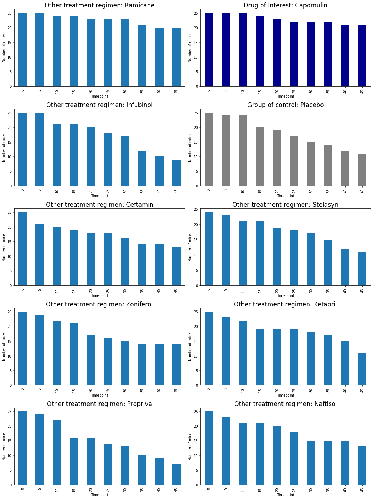
    


```python
# Generate a bar plot showing the number of mice per time point for each treatment throughout the course of the study using pyplot.
#For this it was necesary the funtion xticks and the change the propeties of plt.bar()

fig4=plt.figure(figsize=(15,20), tight_layout=True)

for n in range(len(DrugName)):
    fig4.add_subplot(5,2,n+1)
    if DrugName[n]==DrugOfInterest:
        plt.bar(TimePoint, SummaryDrugRegimen[n]['Mice count'], width=3, color='darkblue')
        plt.title(f'Drug of Interest: {DrugName[n]}', fontsize='xx-large')
    
    elif DrugName[n]==GroupOfControl:
        plt.bar(TimePoint, SummaryDrugRegimen[n]['Mice count'], width=3, color='grey')
        plt.title(f'Group of control: {DrugName[n]}', fontsize='xx-large')    
    
    else:
        plt.bar(TimePoint, SummaryDrugRegimen[n]['Mice count'], width=3)
        plt.title(f'Other treatment regimen: {DrugName[n]}', fontsize='xx-large')        
    
    plt.ylabel('Number of mice')
    plt.xlabel('Timepoint')
    plt.xticks(TimePoint, rotation='vertical')
    

plt.show()


```


    
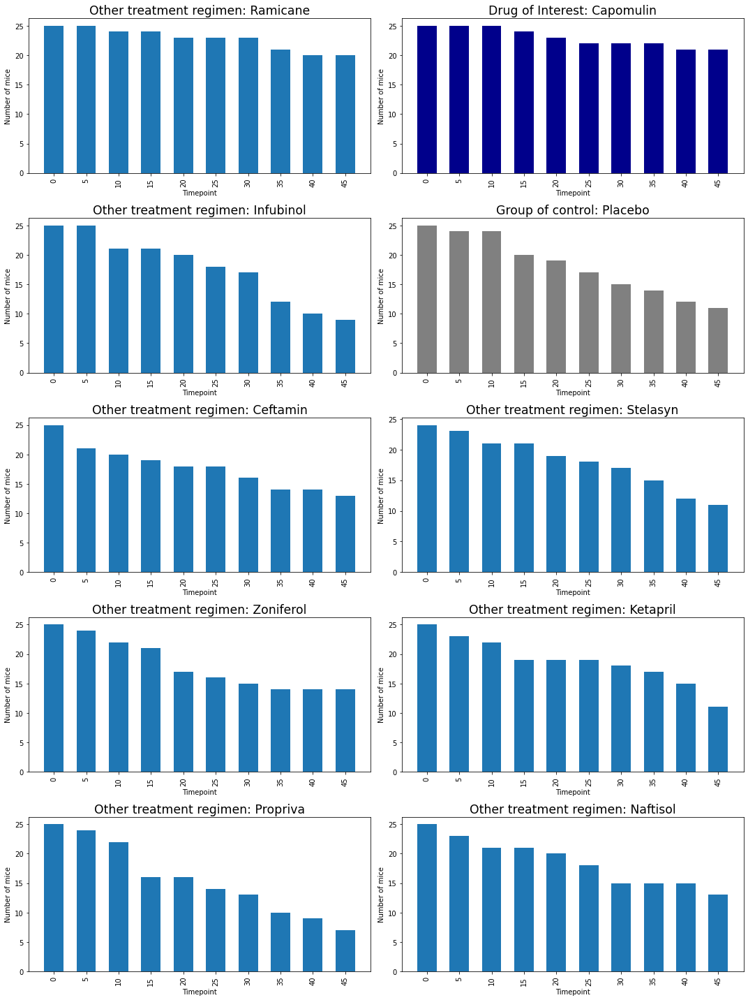
    


```python

```

## Pie Plots


```python
# Generate a pie plot showing the distribution of female versus male mice using pandas

fig5=plt.figure(figsize=(15,20), tight_layout=True)
colors = ["lightcoral", "lightskyblue"]

for time in range(len(TimePoint)):
    fig5.add_subplot(5,2,time+1)
    FramesByTime[time].groupby(['Sex'])['Mouse ID'].count().plot(kind='pie', mark_right=False, colors=colors, autopct="%1.1f%%", startangle=45)
    plt.title(f'Distribution in the day {TimePoint[time]} of Timepoint')    

plt.show()


```


    
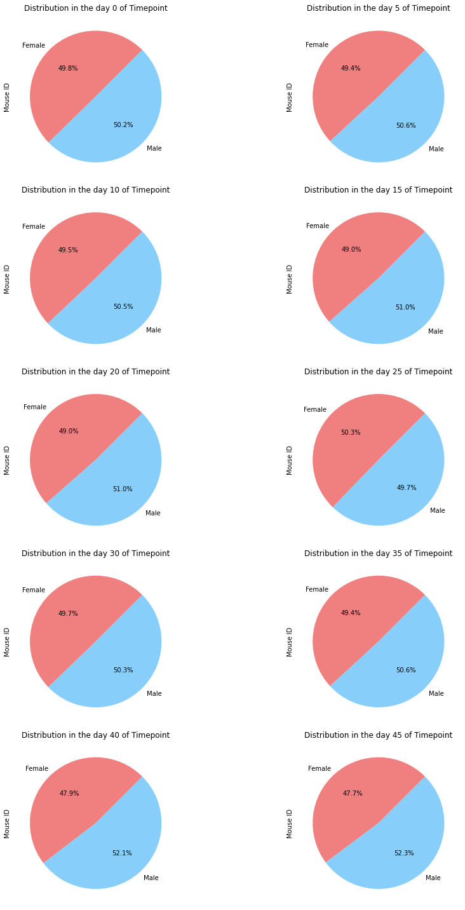
    


```python
# Generate a pie plot showing the distribution of female versus male mice using pyplot

fig6=plt.figure(figsize=(15,20), tight_layout=True)
colors = ["lightcoral", "lightskyblue"]

for time in range(len(TimePoint)):
    fig6.add_subplot(5,2,time+1)
    plt.pie(FramesByTime[time].groupby(['Sex'])['Mouse ID'].count(), colors=colors, autopct="%1.1f%%", startangle=45, labels=['Female','Male'])
    plt.title(f'Distribution in the day {TimePoint[time]} of Timepoint')    
plt.show()


```


    
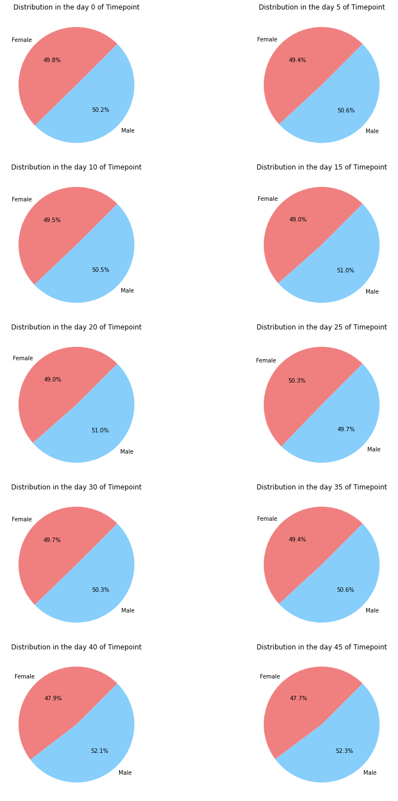
    


```python

```

## Quartiles, Outliers and Boxplots


```python
# Calculate the final tumor volume of each mouse across four of the most promising treatment regimens. Calculate the IQR and quantitatively determine if there are any potential outliers. 

```


```python
#Instructions four most proising:  Capomulin, Ramicane, Infubinol, and Ceftamin

InstrutionsIndex=[]
for drug in range(len(InstrutionsSet)):
    for n in range(len(DrugName)):
        if DrugName[n]==InstrutionsSet[drug]:
            InstrutionsIndex.append(n)

```


```python
#Data to plot for instructions         
           
InstrutionsRegimens=[]
InstrutionsRegimensName=[]
for Int in range(len(InstrutionsIndex)):
    LastPoint=pd.DataFrame(FramesByDrug[InstrutionsIndex[Int]]).drop_duplicates(subset=['Mouse ID'], keep='last', inplace=False)
    InstrutionsRegimens.append(LastPoint['Tumor Volume (mm3)'])
    InstrutionsRegimensName.append(DrugName[InstrutionsIndex[Int]]) 
```


```python
fig7, ax1 = plt.subplots(figsize=(10,8), tight_layout=True)
ax1.set_title('Final tumor volume of each mouse across instructions treatment regimens',fontsize='xx-large')
ax1.boxplot(InstrutionsRegimens, flierprops=square)
ax1.set_ylabel('Tumor Volume (mm3)', fontsize='large')
ax1.set_xticklabels(InstrutionsRegimensName, fontsize='large')
plt.show()
```


    
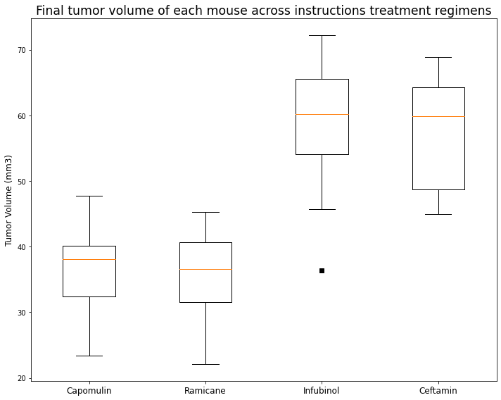
    


```python
# Calculate the IQR and quantitatively determine if there are any potential outliers. 

for regimen in range(len(InstrutionsRegimens)):

    quartiles = InstrutionsRegimens[regimen].quantile([.25,.5,.75])
    lowerq = quartiles[0.25]
    upperq = quartiles[0.75]
    iqr = upperq-lowerq
    lower_bound = lowerq - (1.5*iqr)
    upper_bound = upperq + (1.5*iqr)

    output=f''' For the regimen drug: {InstrutionsRegimensName[regimen]}
    -------------------------------------------------------
    The lower quartile of tumor volume is: {round(lowerq,2)}
    
    The upper quartile of tumor volume is: {round(upperq,2)}
    
    The interquartile range of tumor volume is: {round(iqr,2)}
    
    The the median of tumor volume is: {round(quartiles[0.5],2)}
    
    Values below {round(lower_bound,2)} could be outliers.
    
    Values above {round(upper_bound,2)} could be outliers.

    '''
    fig , ax=plt.subplots()
    
    ax.set_title(InstrutionsRegimensName[regimen])
    ax.boxplot(InstrutionsRegimens[regimen], flierprops=square, autorange=True )
    ax.set_ylabel('Tumor Volume (mm3)', fontsize='large')

   
    ax.plot()
    ax.text(1.75,InstrutionsRegimens[regimen].min(), output, style='normal',
            bbox={'facecolor': 'grey', 'alpha': 0.1, 'pad': 10})

    plt.show()
    print(f'''
    ------------------------------------------------------------------------------------------------''')
```


    

    


    
        ------------------------------------------------------------------------------------------------
    


    

    


    
        ------------------------------------------------------------------------------------------------
    


    
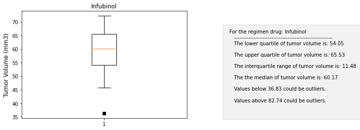
    


    
        ------------------------------------------------------------------------------------------------
    


    
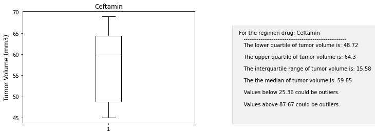
    


    
        ------------------------------------------------------------------------------------------------
    


```python
#Other: Propousing estimate the most promising treatment regiments with number of mice and tumor volumne (mm3)

LastTimePoint=FramesByTime[-1].groupby(['Drug Regimen']).agg(['count','mean'])['Tumor Volume (mm3)']
FirstTimePoint=FramesByTime[0].groupby(['Drug Regimen']).agg(['count','mean'])['Tumor Volume (mm3)']

ScoreDrugRegimen=pd.merge(LastTimePoint, FirstTimePoint, how='outer', on='Drug Regimen', suffixes=("_Last","_First") )

ScoreDrugRegimen['Score survival of mice']=((ScoreDrugRegimen['count_Last']/ScoreDrugRegimen['count_First'])-1)*100
ScoreDrugRegimen['Score disminution of tumor']=((ScoreDrugRegimen['mean_Last']/ScoreDrugRegimen['mean_First'])-1)*100
ScoreDrugRegimen['Final Score']=(-0.5)*ScoreDrugRegimen['Score disminution of tumor']+(0.5)*ScoreDrugRegimen['Score survival of mice']

ScoreDrugRegimen=ScoreDrugRegimen.sort_values(by=['Final Score'], ascending=False).head(4) #flexible to change or to use all data 


ScoreDrugRegimen 

```


<div>
<style scoped>
    .dataframe tbody tr th:only-of-type {
        vertical-align: middle;
    }

    .dataframe tbody tr th {
        vertical-align: top;
    }

    .dataframe thead th {
        text-align: right;
    }
</style>
<table border="1" class="dataframe">
  <thead>
    <tr style="text-align: right;">
      <th></th>
      <th>count_Last</th>
      <th>mean_Last</th>
      <th>count_First</th>
      <th>mean_First</th>
      <th>Score survival of mice</th>
      <th>Score disminution of tumor</th>
      <th>Final Score</th>
    </tr>
    <tr>
      <th>Drug Regimen</th>
      <th></th>
      <th></th>
      <th></th>
      <th></th>
      <th></th>
      <th></th>
      <th></th>
    </tr>
  </thead>
  <tbody>
    <tr>
      <th>Capomulin</th>
      <td>21</td>
      <td>36.236114</td>
      <td>25</td>
      <td>45.0</td>
      <td>-16.0</td>
      <td>-19.475303</td>
      <td>1.737651</td>
    </tr>
    <tr>
      <th>Ramicane</th>
      <td>20</td>
      <td>34.955595</td>
      <td>25</td>
      <td>45.0</td>
      <td>-20.0</td>
      <td>-22.320900</td>
      <td>1.160450</td>
    </tr>
    <tr>
      <th>Ceftamin</th>
      <td>13</td>
      <td>64.132421</td>
      <td>25</td>
      <td>45.0</td>
      <td>-48.0</td>
      <td>42.516492</td>
      <td>-45.258246</td>
    </tr>
    <tr>
      <th>Zoniferol</th>
      <td>14</td>
      <td>65.960888</td>
      <td>25</td>
      <td>45.0</td>
      <td>-44.0</td>
      <td>46.579751</td>
      <td>-45.289875</td>
    </tr>
  </tbody>
</table>
</div>


```python
#Serch only the most promisig treatment regimens acording score

#Set only the index to use FramesByDrug
IndexScore=[]
for drug in ScoreDrugRegimen.index:
    for n in range(len(DrugName)):
        if DrugName[n]==drug:
            IndexScore.append(n)

#Data to plot             
           
PromisingRegimens=[]
PromisingRegimensName=[]
for Int in range(len(IndexScore)):
    LastPoint=pd.DataFrame(FramesByDrug[IndexScore[Int]]).drop_duplicates(subset=['Mouse ID'], keep='last', inplace=False)
    PromisingRegimens.append(LastPoint['Tumor Volume (mm3)'])
    PromisingRegimensName.append(DrugName[IndexScore[Int]])
    
```


```python
#Instruction to plot

fig8, ax1 = plt.subplots(figsize=(10,8), tight_layout=True)
ax1.set_title('Final tumor volume of each mouse across four of the most promising treatment regimens',fontsize='xx-large')
ax1.boxplot(PromisingRegimens, flierprops=square)
ax1.set_ylabel('Tumor Volume (mm3)', fontsize='large')
ax1.set_xticklabels(PromisingRegimensName, fontsize='large')
plt.show()

```


    
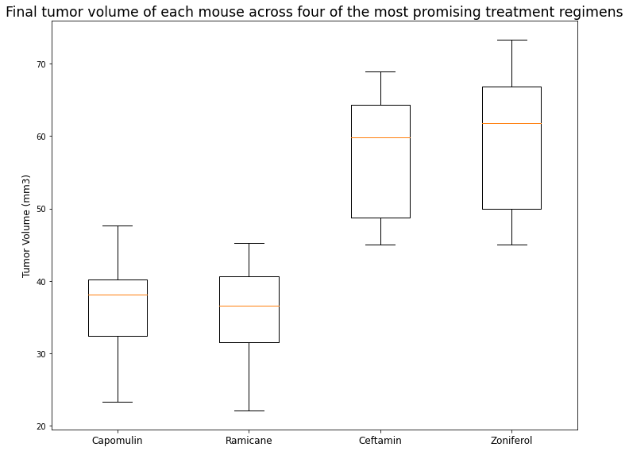
    


```python
# Calculate the IQR and quantitatively determine if there are any potential outliers. 

for regimen in range(len(PromisingRegimens)):

    quartiles = PromisingRegimens[regimen].quantile([.25,.5,.75])
    lowerq = quartiles[0.25]
    upperq = quartiles[0.75]
    iqr = upperq-lowerq
    lower_bound = lowerq - (1.5*iqr)
    upper_bound = upperq + (1.5*iqr)

    output=f''' For the regimen drug: {PromisingRegimensName[regimen]}
    -------------------------------------------------------
    The lower quartile of tumor volume is: {round(lowerq,2)}
    
    The upper quartile of tumor volume is: {round(upperq,2)}
    
    The interquartile range of tumor volume is: {round(iqr,2)}
    
    The the median of tumor volume is: {round(quartiles[0.5],2)}
    
    Values below {round(lower_bound,2)} could be outliers.
    
    Values above {round(upper_bound,2)} could be outliers.

    '''
    fig , ax=plt.subplots()
    
    ax.set_title(PromisingRegimensName[regimen])
    ax.boxplot(PromisingRegimens[regimen], flierprops=square, autorange=True )
    ax.set_ylabel('Tumor Volume (mm3)', fontsize='large')

   
    ax.plot()
    ax.text(1.75,PromisingRegimens[regimen].min(), output, style='normal',
            bbox={'facecolor': 'grey', 'alpha': 0.1, 'pad': 10})

    plt.show()
    print(f'''
    ------------------------------------------------------------------------------------------------''')
```


    
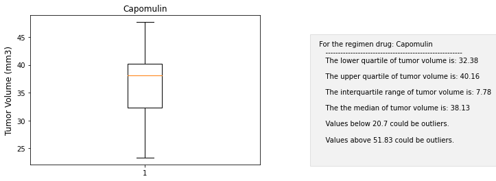
    


    
        ------------------------------------------------------------------------------------------------
    


    
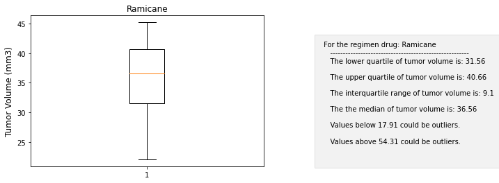
    


    
        ------------------------------------------------------------------------------------------------
    


    

    


    
        ------------------------------------------------------------------------------------------------
    


    

    


    
        ------------------------------------------------------------------------------------------------
    

 For box plot of all regimens see Other Plots


## Line and Scatter Plots


```python
# Generate a line plot of time point versus tumor volume for a mouse treated with Capomulin
#Set Frame of mice in treated with the drug of interest

Frame=FramesByDrug[1]
MiceInDrugOfInterest=[mouse for mouse in Frame['Mouse ID'].unique()]

FramesInDrugOfInterest=[]
for mouse in MiceInDrugOfInterest:
    FramesInDrugOfInterest.append(FramesByDrug[1].loc[lambda Frame:Frame['Mouse ID']==mouse])


name=FramesInDrugOfInterest[0]['Mouse ID'].unique()

```


```python
#Plot only one mouse in Drug of Interest
plt.plot(TimePoint,FramesInDrugOfInterest[0]['Tumor Volume (mm3)'])
plt.title(f'Mouse ID: {name[0]}', fontsize='xx-large')
plt.ylabel('Tumor Volume (mm3)')
plt.xlabel('Timepoint')
plt.xticks(TimePoint, rotation='vertical')
plt.show()

```


    
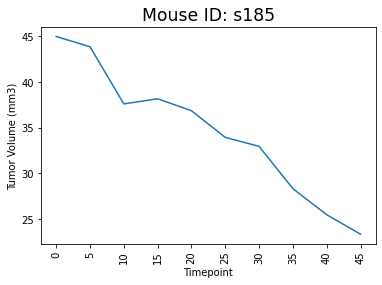
    


In Other Plots is show the group of interest each mouse tumor volume evolution


```python
#Create the series to the scatter plot

WeigthAveMouse=[]
TumorAveMouse=[]
Mouse=[]

for mouse in range(len(MiceInDrugOfInterest)):
    WeigthAveMouse.append(FramesInDrugOfInterest[mouse]['Weight (g)'].mean())
    TumorAveMouse.append(FramesInDrugOfInterest[mouse]['Tumor Volume (mm3)'].mean())
    Mouse.append(MiceInDrugOfInterest[mouse])

ScatterDrugInterest=pd.DataFrame({
    'Mouse ID':Mouse,
    'Ave Weigth (g)':WeigthAveMouse,
    'Ave Tumor Volume (mm3)':TumorAveMouse
}, index=[Mouse])
    
   
    
```

## Correlation and Regression


```python
# Generate a scatter plot of mouse weight versus average tumor volume for the Capomulin regimen
 
# Calculate the correlation coefficient and linear regression model
# for mouse weight and average tumor volume for the Capomulin regimen
# Add the linear regression equation and line to plot

x_values = ScatterDrugInterest['Ave Weigth (g)']
y_values = ScatterDrugInterest['Ave Tumor Volume (mm3)']
(slope, intercept, rvalue, pvalue, stderr) = linregress(x_values, y_values)
regress_values = x_values * slope + intercept
line_eq = "y = " + str(round(slope,2)) + "x + " + str(round(intercept,2))
correlation = st.pearsonr(x_values,y_values)

#Plot
fig9=plt.figure(figsize=(10,7), tight_layout=True)
plt.scatter(x_values,y_values, s=None, c='grey', marker=r'$\partial$',
            label="Mouse")
plt.plot(x_values,regress_values,color="blue")
plt.title('Mouse weigth versus average tumor volume for Drug of Interest', fontsize='xx-large')
plt.xlabel('Weight (g)', fontsize='large')
plt.annotate(f'Regression equation: {line_eq}',(x_values.min(),y_values.max()),fontsize='large',color="black")
plt.ylabel('Tumor Volume (mm3)', fontsize='large')
plt.show()

print(f"The correlation between Mouse weigth and averange tumor volume is {round(correlation[0],2)}")


```


    
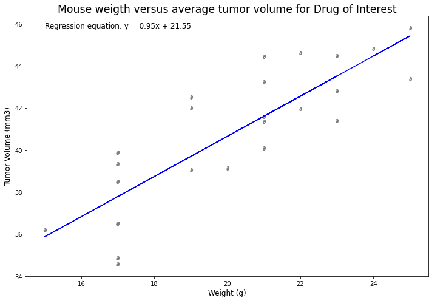
    


    The correlation between Mouse weigth and averange tumor volume is 0.84
    

# Others plots

### Box Plot final tumor volume of each mouse of all regimens


```python
# Generate a box plot of the final tumor volume of each mouse across all regimen
BoxPlotData=[]
BoxPlotlabels=[]
for drug in range(len(DrugName)):
    LastPoint=pd.DataFrame(FramesByDrug[drug]).drop_duplicates(subset=['Mouse ID'], keep='last', inplace=False)
    BoxPlotData.append(LastPoint['Tumor Volume (mm3)'])
    BoxPlotlabels.append(DrugName[drug]) 
```


```python
fig10, ax1 = plt.subplots(figsize=(10,8), tight_layout=True)
ax1.set_title('Final tumor volume in the Study',fontsize='xx-large')
ax1.boxplot(BoxPlotData, flierprops=square)
ax1.set_ylabel('Tumor Volume (mm3)', fontsize='large')
ax1.set_xticklabels(BoxPlotlabels, fontsize='large')
plt.show()
```


    
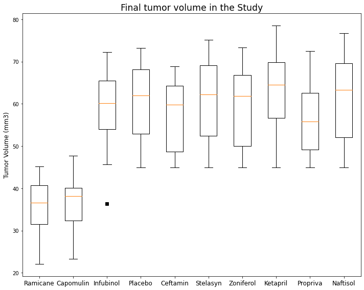
    


```python
# Calculate the IQR and quantitatively determine if there are any potential outliers.
for regimen in range(len(BoxPlotData)):

    quartiles = BoxPlotData[regimen].quantile([.25,.5,.75])
    lowerq = quartiles[0.25]
    upperq = quartiles[0.75]
    iqr = upperq-lowerq
    lower_bound = lowerq - (1.5*iqr)
    upper_bound = upperq + (1.5*iqr)

    output=f''' For the regimen drug: {BoxPlotlabels[regimen]}
    -------------------------------------------------------
    The lower quartile of tumor volume is: {round(lowerq,2)}
    
    The upper quartile of tumor volume is: {round(upperq,2)}
    
    The interquartile range of tumor volume is: {round(iqr,2)}
    
    The the median of tumor volume is: {round(quartiles[0.5],2)}
    
    Values below {round(lower_bound,2)} could be outliers.
    
    Values above {round(upper_bound,2)} could be outliers.

    '''
    fig , ax=plt.subplots()
    
    ax.set_title(BoxPlotlabels[regimen])
    ax.boxplot(BoxPlotData[regimen], flierprops=square, autorange=True )
    ax.set_ylabel('Tumor Volume (mm3)', fontsize='large')
    ax.plot()
    ax.text(1.75,BoxPlotData[regimen].min(), output, style='normal',
            bbox={'facecolor': 'grey', 'alpha': 0.1, 'pad': 10})

    plt.show()
    print(f'''
    ------------------------------------------------------------------------------------------------''')
```


    

    


    
        ------------------------------------------------------------------------------------------------
    


    

    


    
        ------------------------------------------------------------------------------------------------
    


    

    


    
        ------------------------------------------------------------------------------------------------
    


    

    


    
        ------------------------------------------------------------------------------------------------
    


    

    


    
        ------------------------------------------------------------------------------------------------
    


    

    


    
        ------------------------------------------------------------------------------------------------
    


    

    


    
        ------------------------------------------------------------------------------------------------
    


    
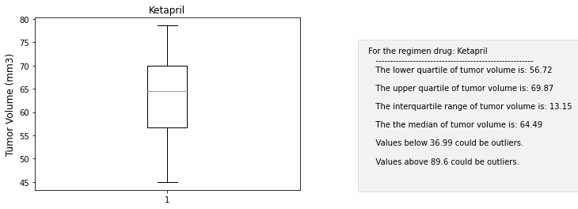
    


    
        ------------------------------------------------------------------------------------------------
    


    
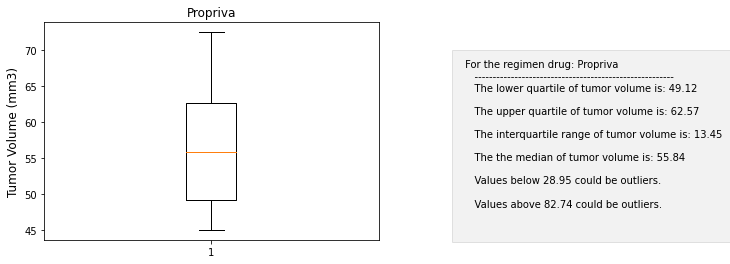
    


    
        ------------------------------------------------------------------------------------------------
    


    

    


    
        ------------------------------------------------------------------------------------------------
    

### Multiple plot of mice in group of interest


```python
#Show the evolution of each mice in the group of interest

figf=plt.figure(figsize=(15,20), tight_layout=True)

for m in range(len(MiceInDrugOfInterest)):
    y=FramesInDrugOfInterest[m]['Tumor Volume (mm3)']
    x=[TimePoint[i] for i in range(len(y))]
    figf.add_subplot(9,3,m+1)
    plt.plot(x,y)
    plt.title(f'Mouse ID: {MiceInDrugOfInterest[m]}', fontsize='xx-large')
   
    plt.xticks(x, rotation='vertical')
    plt.ylabel('Tumor Volume (mm3)')
    plt.xlabel('Timepoint')
   
plt.show()
```


    
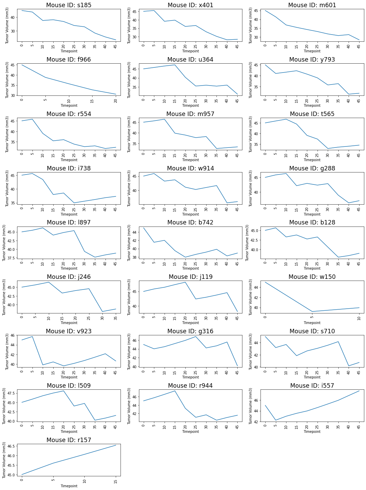
    


```python

```
